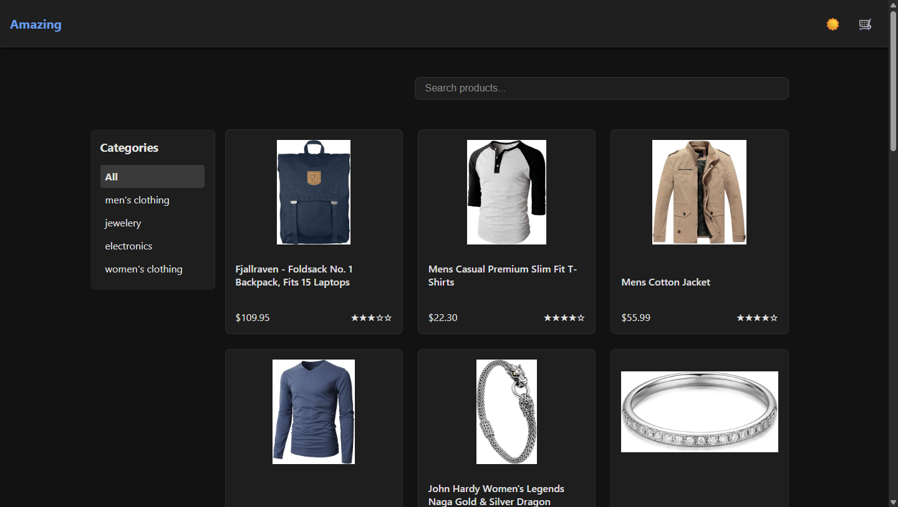
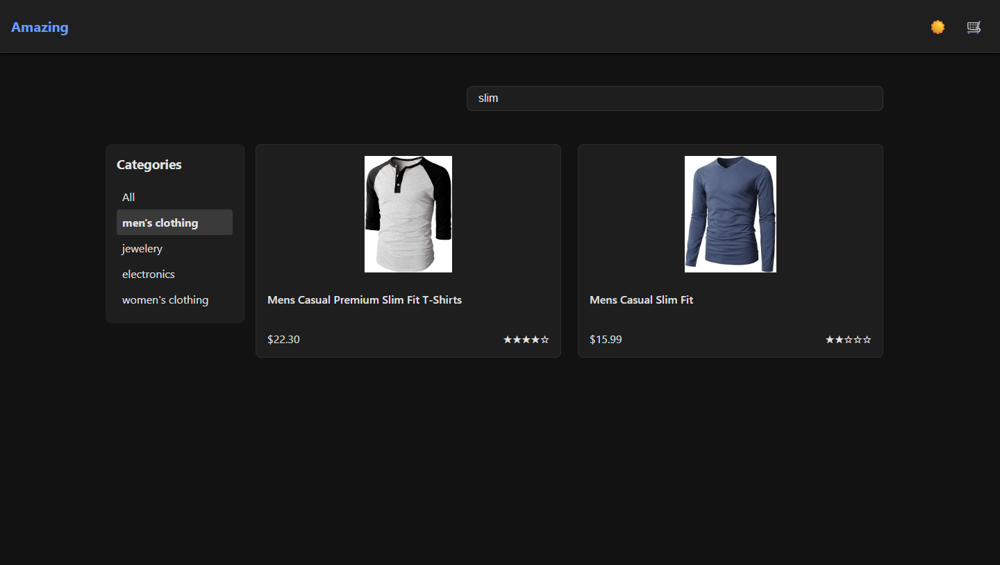
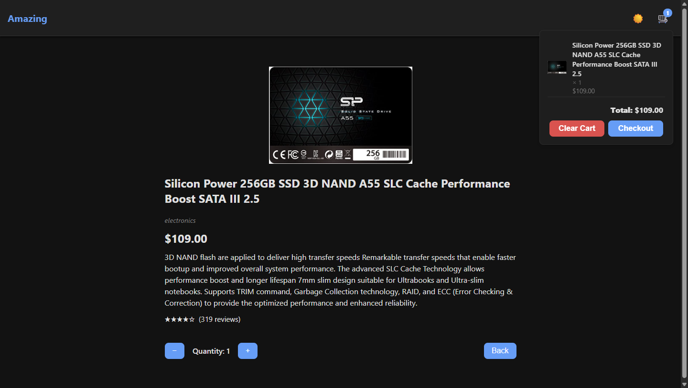
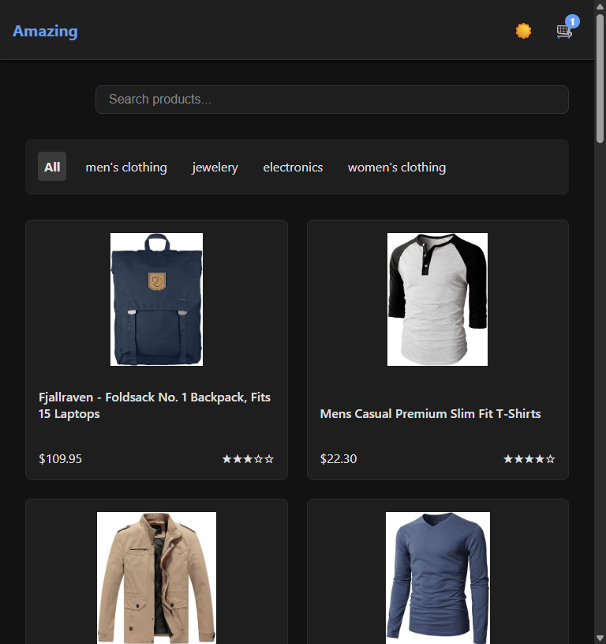

# 🛒 React Product Catalog App

This is a fully responsive React application built with Vite that showcases a product catalog using the [FakeStoreAPI](https://fakestoreapi.com).

> ✅ **Bootstrapped with the official [Vite React + TypeScript template](https://github.com/vitejs/vite/tree/main/packages/create-vite/template-react-ts)**

---

## 📦 Tech Stack

- **React**
- **TypeScript**
- **Vite**
- **React Router**
- **React Query** for data fetching
- **Axios** for HTTP requests
- **Vitest** + **@testing-library/react** for testing
- **CSS Modules / Vanilla CSS** for styling (no UI libraries)

---

## 🚀 Getting Started

### 1. Clone the Repository

```bash
git clone https://github.com/wanderingsoul506/hatchworks.git
```

### 2. Install Dependencies

```bash
npm install
```

### 3. Run the App

```bash
npm run dev
```

Visit: [http://localhost:5173](http://localhost:5173)

---

## 🧪 Run Tests

```bash
npm run test
```

Tests are written for UI components, utilities, and API calls.

---

## 📷 Screenshots

### Product List Page



### Filtering



### Product Details


### Cart Popup



### Product List Page Mobile



### Product Details Mobile


---
